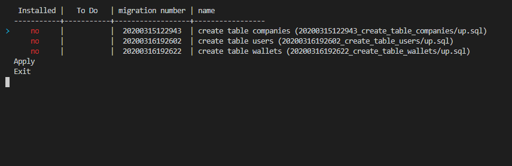

Migrate is a migration tool for PostgreSQL/MySQL/SQLite, with in mind:
  - Fast
  - Multi platform
  - Easy to compile & use
  - Atomic migration

It's ultimate goal would be to be usable for any project.  
A one stop tool that focus on what matters: giving you a system of up & down
migration files that you don't have to re-learn every time you use a new
language or create a new project.


# Why another one?

There is already many migration tool out there, most of them have problem with
one or more of the points above. And none of them have the interactive mode
created for this tool, that is a unique feature that helps developers to get
things up & running in no time.


# What is the interactive mode?

The interactive mode is a new way to handle your migration scripts:  



This will speed up you development by having an easy to use interface
to put your database in any state very quickly.


# Available commands

The following commands are supported:

  * **create**: will create a new migration file, based on timestamp + name
  given.
  * **up**: will migrate one or more migration files, based on what's remains
  to be
  migrated.
  * **down**: will revert one or more previously migrated files.
  * **interactive**: will trigger the interactive mode.
  * **status**: will show the status of migrations & database state.

All of them support many options, so have a look using --help like:
```bash
migrate up --help
```


# Supported database

For now the list of supported database is:

  * PostgreSQL
  * MySQL
  * SQLite


# How to compile

It's a cargo application, so you need [rust](https://www.rust-lang.org/) installed, then:

```
cargo build --release
```

From the root folder of this project.